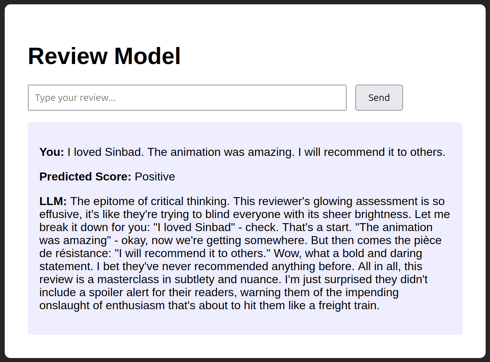
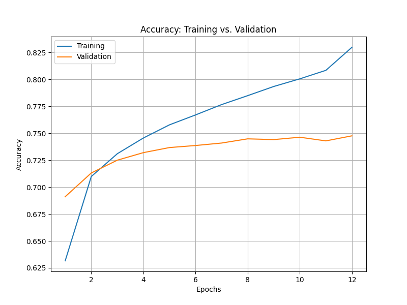
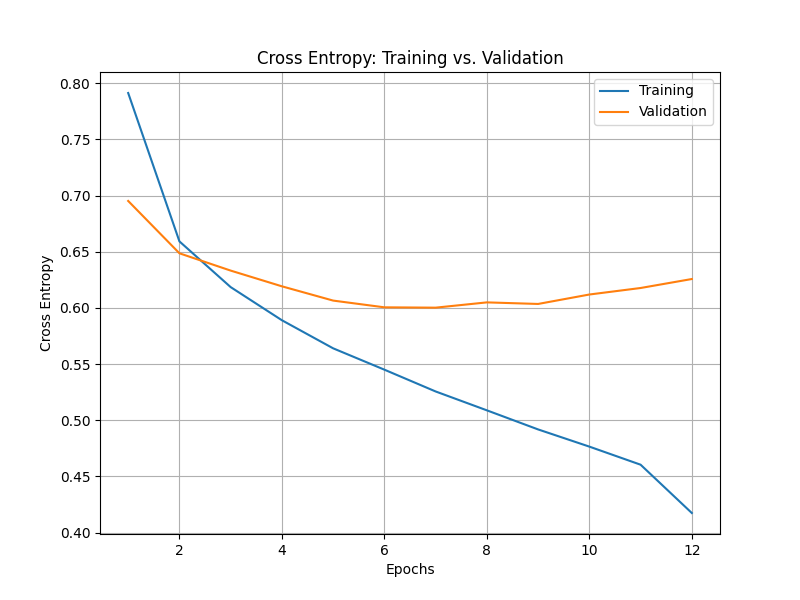

<h1>Movie/TV Review Classification Model</h1>
A sentiment analysis web application that classifies Amazon movie and TV reviews using a bi-directional LSTM neural network. The app provides real-time predictions with AI-powered responses using Llama 3.1:8b.

<h2>Table of Contents</h2>

<!-- TOC -->
  * [Overview](#overview)
    * [Project Structure](#project-structure)
    * [File Descriptions](#file-descriptions)
    * [Data](#data)
  * [Installation & Setup](#installation--setup)
    * [Prerequisites](#prerequisites)
    * [Without Docker](#without-docker)
    * [With Docker](#with-docker)
      * [Build & Run](#build--run)
      * [Stop Container](#stop-container)
      * [View Logs](#view-logs)
  * [Usage](#usage)
  * [Model Training](#model-training)
  * [Model Performance](#model-performance)
  * [Technologies Used](#technologies-used)
<!-- TOC -->

## Overview

This project builds and deploys a bi-directional LSTM (Long Short-Term Memory) sentiment classifier trained on Amazon movie and TV reviews. The model predicts sentiment across three categories: negative, neutral, and positive.

### Features

* **Bi-directional LSTM Neural Network**: Deep learning model for accurate sentiment classification
* **Real-time Predictions**: Instant sentiment analysis through a web interface
* **AI-Enhanced Responses**: Utilizes Llama 3.1:8b LLM to generate creative, contextual responses based on predictions
* **Interactive Web UI**: Simple, user-friendly interface for inputting reviews
* **Docker Support**: Containerized deployment for easy setup and portability
* **Training Visualizations**: Accuracy and loss plots to monitor model performance

### Project Structure

```
├── Movies_and_TV.jsonl (LSTM classifier training/validation data)
├── README.md
├── classifier/
    ├── accuracy_plot.png
    ├── cross_entropy_plot.png
    ├── example_webpage_output.png
    ├── lstm_analyzer.log
    └── lstm_sentiment_classifier.pt
├── src/
     ├── constants.py
     ├── helper.py
     ├── lstm_analyzer.py
     └──  main.py
├── static/
    └── style.css
├── templates/
    ├── base.html
    └── index.html
└── docker/
    ├── docker-compose.yml
    ├── Dockerfile
    ├── init_container.sh
    ├── requirements.txt
    └── supervisord.conf
```

### File Descriptions

#### Classifier Directory
* `accuracy_plot.png`: Visualization showing training and validation accuracy over epochs
* `cross_entropy_plot.png`: Visualization showing cross-entropy loss during training and validation over epochs
* `example_webpage_output.png`: Screenshot of the web interface showing a sample prediction
* `lstm_analyzer.log`: Detailed logs from the training process
* `lstm_sentiment_classifier.pt`: PyTorch model checkpoint containing trained weights

#### Source Code Directory
* `constants.py`: Defines hyperparameters/configuration for bi-directional LSTM classifier
* `helper.py`: Contains utility functions for data preprocessing and text processing
* `lstm_analyzer.py`: Implements the bi-directional LSTM model architecture, training loop, and validation
* `main.py`: FastAPI application that serves the web interface and handles predictions

#### Templates & Static
* `base.html`: Base HTML template
* `index.html`: Main page featuring the review input form and results display
* `style.css`: CSS styles for the web interface

#### Docker Directory
* `docker-compose.yml`: Defines services, ports, and volumes for Docker deployment
* `Dockerfile`: Instructions for building the Docker image
* `init_container.sh`: Shell script to initialize the container environment
* `requirements.txt`: Python package dependencies
* `supervisord.conf`: Configuration for managing the Ollama and Uvicorn processes in the container

### Data

* **Source**: [Amazon Reviews 2023 Dataset](https://amazon-reviews-2023.github.io/)
* **Subset Used**: `Movies_and_TV` data from the "Grouped by Category" section
* **Format**: JSONL (JSON Lines) format with review text and ratings
* **Size**: Contains movie and TV product reviews from Amazon

The dataset includes:
- Review text
- Star ratings (1-5)
- Product metadata
- Reviewer information

**Sentiment Label Binning:**
- **Negative**: 1-2 stars
- **Neutral**: 3 stars
- **Positive**: 4-5 stars

## Installation & Setup

### Prerequisites

**Without Docker:**
* Python 3.12 or higher
* pip (Python package manager)
* Virtual environment (recommended)
* **Ollama 0.11.3** with Llama 3.1:8b model installed

**With Docker:**
* Docker Engine 29.1.3 or higher
* Docker Compose 5.0.1 or higher

**Clone the repository:**
```bash
git clone https://github.com/pavred94/sentiment_classifier.git
cd sentiment_classifier
```

### Without Docker

1. Create and activate a virtual environment:
```bash
python -m venv venv
source venv/bin/activate  # On Windows: venv\Scripts\activate
```

2. Install dependencies:
```bash
pip install -r docker/requirements.txt
```

3. Install and setup Ollama:
- Linux: `curl -fsSL https://ollama.com/install.sh | OLLAMA_VERSION=0.11.3 sh`
- MacOS/Windows: Download v0.11.3 from [https://github.com/ollama/ollama/releases/tag/v0.11.3](https://github.com/ollama/ollama/releases/tag/v0.11.3)

**Pull the Llama 3.1:8b model:**
```bash
ollama pull llama3.1:8b
```

**Start Ollama server** (if not already running):
```bash
ollama serve
```

The Ollama API will be available at `http://localhost:11434`

4. Run the application:

From the project's root directory:

```bash
cd src
uvicorn main:app --reload --port 8000
```

The application will be available at `http://localhost:8000`

**Options:**
* `--reload`: Enable auto-reload on code changes (development mode)
* `--port 8000`: Specify the port (default: 8000)
* `--host 0.0.0.0`: Make the server accessible from other machines

### With Docker

Ensure Docker and Docker Compose are installed:
```bash
docker --version
docker compose version
```

#### Build & Run

Build and run the container in detached mode (background):

```bash
cd docker
sudo docker compose up -d --build
```

The application will be available at `http://localhost:8000`

**Note**: The `--build` flag forces a rebuild of the image. Omit it for subsequent runs if no changes were made.

#### Stop Container

Stop the running container:

```bash
cd docker
sudo docker compose down
```

To stop and remove volumes:

```bash
sudo docker compose down -v
```

#### View Logs

View real-time logs:

```bash
sudo docker compose logs -f app
```

## Usage
1. **Access the Web Interface**: Navigate to `http://localhost:8000` in your web browser

2. **Input a Review**: Enter a movie or TV show review in the text area

3. **Get Prediction**: Click the submit button to receive:
   - Sentiment classification (Negative, Neutral, or Positive)
   - AI-generated creative response from Llama 3.1:8b

4. **Example Reviews to Try**:
   - *Positive*: "This movie was absolutely fantastic! The acting was superb and the plot kept me engaged throughout."
   - *Negative*: "Terrible show. Poor acting, weak storyline, and a complete waste of time."
   - *Neutral*: "It was okay. Some parts were good, others not so much. Average overall."

### Example Output



*The web interface showing a positive review prediction with the LLM-generated response*

## Model Training

To train the model from scratch:

1. Ensure the `Movies_and_TV.jsonl` dataset is in the project root (Reference [data section](#data))

2. Run the training script:
```bash
cd src
python lstm_analyzer.py
```

3. Training outputs:
   - Model checkpoint: `lstm_sentiment_classifier.pt`
   - Accuracy plot: `accuracy_plot.png`
   - Loss plot: `cross_entropy_plot.png`
   - Training logs: `lstm_analyzer.log`

**Training Configuration** (defined in `src/constants.py` and `src/lstm_analyzer.py`):
* **Embedding Dimension**: 100
* **Hidden Layer Size**: 100
* **Number of LSTM Layers**: 1
* **Dropout Rate**: 0.0
* **Output Dimension**: 3 (Negative, Neutral, Positive)
* **Batch Size**: 16 (training), 128 (validation)
* **Optimizer**: AdamW with learning rate 1e-4 and weight decay 5e-3
* **Learning Rate Scheduler**: ReduceLROnPlateau (patience=3, factor=0.1)
* **Number of Epochs**: 12

## Model Performance

The model was trained for 12 epochs on the Amazon Movies and TV reviews dataset with 400,000 total samples (balanced across negative, neutral, and positive classes with 133,333 samples each). Below are the training and validation metrics:

### Training Progress

**The final model was saved at Epoch 7**, which achieved the **lowest validation loss (0.6002)** of all training epochs. This represents the optimal point before overfitting begins.

| Epoch | Training Accuracy | Training Loss | Validation Accuracy | Validation Loss | Status |
|-------|------------------|---------------|---------------------|-----------------|--------|
| **Epoch 1** | 63.16% | 0.7913 | 69.11% | 0.6952 | MODEL SAVED! |
| **Epoch 2** | 70.98% | 0.6592 | 71.31% | 0.6486 | MODEL SAVED! |
| **Epoch 3** | 73.10% | 0.6185 | 72.50% | 0.6332 | MODEL SAVED! |
| **Epoch 4** | 74.56% | 0.5890 | 73.20% | 0.6192 | MODEL SAVED! |
| **Epoch 5** | 75.78% | 0.5640 | 73.67% | 0.6065 | MODEL SAVED! |
| **Epoch 6** | 76.70% | 0.5450 | 73.86% | 0.6005 | MODEL SAVED! |
| **Epoch 7** ✓ | **77.66%** | **0.5256** | **74.09%** | **0.6002** | **MODEL SAVED! (FINAL)** |
| Epoch 8 | 78.49% | 0.5088 | 74.48% | 0.6049 | - |
| Epoch 9 | 79.34% | 0.4918 | 74.41% | 0.6035 | - |
| Epoch 10 | 80.05% | 0.4765 | 74.63% | 0.6119 | - |
| Epoch 11 | 80.84% | 0.4604 | 74.29% | 0.6177 | - |
| Epoch 12 | 82.98% | 0.4174 | 74.76% | 0.6257 | - |

**Key Observations:**
- **Epoch 1 → Epoch 7 (Final Model):**
  - Training accuracy improved from **63.16%** to **77.66%** (+14.50%)
  - Validation accuracy improved from **69.11%** to **74.09%** (+4.98%)
  - Training loss decreased from **0.7913** to **0.5256** (-0.2657)
  - Validation loss decreased from **0.6952** to **0.6002** (-0.0950), reaching its minimum
- **After Epoch 7:** The model begins to overfit, as evidenced by:
  - Validation loss increases from **0.6002** (Epoch 7) to **0.6257** (Epoch 12)
  - Training loss continues to decrease while validation loss increases
  - Widening gap between training and validation performance
- **Epoch 7 produced the final model** used for predictions, representing the best generalization capability

### Accuracy



The gap between training and validation accuracy widens after Epoch 7, suggesting overfitting as training continues.

### Loss (Cross Entropy)



The validation loss plateaus around Epoch 6-7 while training loss continues to decrease, further indicating overfitting.

### Classification Report (Final Model)

The final model achieved **74% overall accuracy** on the validation set with the following per-class performance:

| Sentiment | Precision | Recall | F1-Score | Support |
|-----------|-----------|--------|----------|---------|
| **Negative** | 0.77 | 0.74 | 0.75 | 40,135 |
| **Neutral** | 0.63 | 0.69 | 0.66 | 39,818 |
| **Positive** | 0.84 | 0.79 | 0.81 | 40,047 |
| **Macro Avg** | **0.75** | **0.74** | **0.74** | **120,000** |

**Performance Insights:**
- **Positive** sentiment sees the best performance (F1: 0.81)
- **Neutral** sentiment sees the least performance (F1: 0.66), likely due to the ambiguous nature of 3-star reviews
- **Negative** sentiment shows a balanced performance (F1: 0.75)

Future improvements could include:
- **Additional data**: The dataset was limited due to computational constraints. Expanding the training set will almost certainly improve model performance and generalization
- Additional regularization techniques (dropout, L2 regularization)
- Data augmentation for neutral class to improve detection
- Ensemble methods to improve neutral sentiment detection

## Technologies Used
TODO
